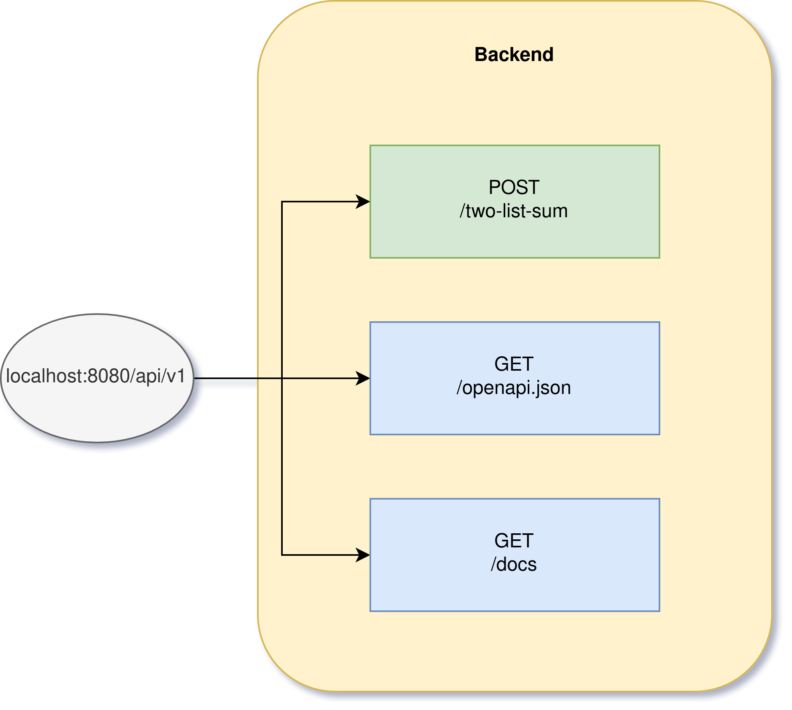
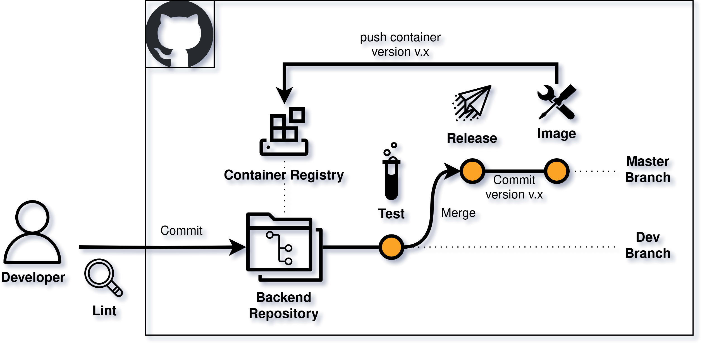
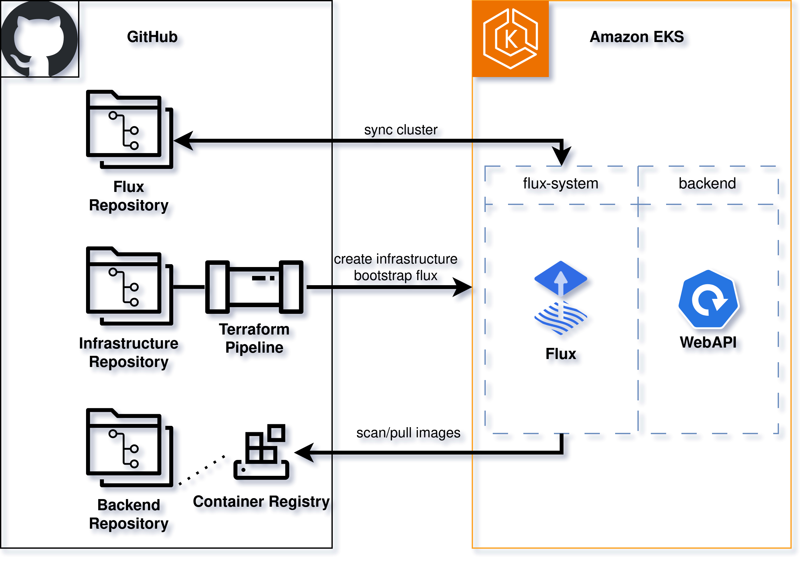

# CASE_STUDY_BACKEND


[](https://github.com/AlbertHahn/case_study_backend/actions/workflows/release-please.yml)

This repository demonstrates a web API backend designed to calculate the target sum from two provided lists.

# Requirements

[pipx](https://github.com/pypa/pipx) pipx is a tool to help you install and run end-user applications written in Python \
[poetry](https://python-poetry.org/docs/) python packaging and dependency management tool \
[pre-commit](https://pre-commit.com/) (optional) framework for managing and maintaining multi-language pre-commit hooks

## Getting Started

Initialize dependencies and packages

```bash
poetry install
poetry shell
```

### Start the application

```bash
uvicorn app.main:app --host 0.0.0.0 --port 8080 --reload
```

__Docker__

```bash
docker build -t backend .
docker run -p 8080:8080 backend
```

__Docker-Compose__

```bash
docker-compose up -d
```

### API Documentation

You can visit the API documentation after starting the application at [docs](http://localhost:8080/api/v1/docs) or get the openapi specification on [openapi](http://localhost:8080/api/v1/openapi.json)

## API Architecture

Diagram with the description of the endpoints




## Directory Structure

The directory structure follows some of the best practices including the example of the creator of FastAPI [Sebastián Ramírez (Tiangolo)](https://github.com/tiangolo/full-stack-fastapi-template/tree/master) and tips I have gathered from [fastapi-best-practices](https://github.com/zhanymkanov/fastapi-best-practices) as well as my own experience.

```bash
.
├── api # API Endpoints
│   ├── main.py
│   └── routes
│       └── two_list_sum.py
├── core # Base Configurations
│   └── config.py
├── internal
│   └── two_list_sum.py
├── main.py # Initializes the FastAPI App
├── models
│   └── models.py
└── tests
    ├── api
    │   └── routes
    │       └── test_two_list_sum.py
    ├── conftest.py # Initializes the client App for testing
    └── internal
        └── test_two_list_sum.py
```


## Continouos Integration

For the CI part of the application GitHub Actions is being used.



### Workflow Files

- [Docker Workflow](actions/workflows/image.yml) responsible for the creation of the Docker container
- [Python Tests](actions/workflows/test.yml) executing tests if /app has changed files
- [Release](actions/workflows/release-please.yml) release action for a new version if a push to the master branch occurred

## Continouos Delivery/Deployment

The CD architecture should be realized in AWS EKS with a GitOps strategy.



### Repositories

- Backend Repository (this repo) should contain the application code and container at it's registry
- Infrastructure Repository is for deploying the EKS Cluster to AWS
- Flux Repository should contain the configuration files for the API to deploy it to EKS and configuration files for the Flux-System itself
